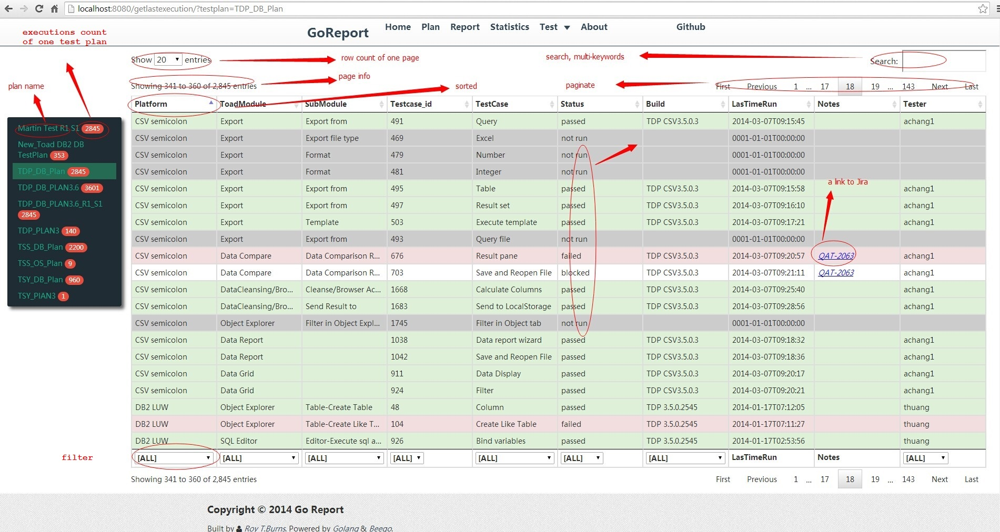

goTestLinkReport
================

Sorry about for this project.
Due to i spend working time on this project, so my company want to take over this project as private project. So I have to delete this project.

You can star my other project [goStockAnalyst](https://github.com/royburns/goStockAnalyst), which use the same architecture and same technology.

A web site for displaying Test Link Report. 
Power by [Golang](http://golang.org) and [Beego](https://github.com/astaxie/beego).

## Devtools:
* Server: Go(Golang, Beego, X-ORM), Redis(Cache)
* Client: Go, js(jQuery, Ajax), CSS(Bootstrap), HTML5

## Features:
* Show all test plans and test case count of each test plan.
* Show all test cases when click the test plan which displays on the Left-Navbar.
* Mark the test case with different color according the status.
* Paging.
* Searching.
* Filter.
* Sorted.
* Issue ID, Link to Jira.

## Note:
* Until now, only the “Report” feature can be used.
* When you click the test plan on the Left-Navbar, it will fetch all the test cases belong the test plan, so it maybe a little slow.
* The first version is rough, welcome to feedback, submit, contribute code.

## TODO:
* Test Plan.
* Executions Statistics.

## Screenshot:
